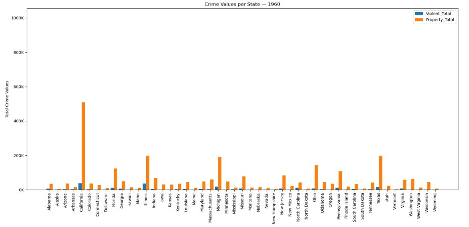

# Would you live there?
Of the 50 States in the United States, which one do you think has the highst crime total? Some might say it is somewhere in a mountain. Others might say it is in a highly populated city or maybe someone in the desert. Whatever the case may be, you do the crime, you do the time. 

### Crimes in 2000 peak interest

A study comparison was done in the United States from 1960 to 2019 based off of crime rates and totals for the following crimes:

| Property| |Violent |
| :------ |:-| :------ |
| Burglary |  | Assult |
| Larceny |  | Murder |
| Motor Vehicle |  | Rape |
| |  | Robbery |

In order to narrow down the study and get a closer look into crime totals, we looked into the year 2000. This year in particular sparked the interest of many due to the widespread fear of threats to society; one of those threats being the Y2K bug that would cause computer failures accross the nation while others predicted the end of the world. Did crimes rise in the year 2000 from 1960? Let's examine some data. 

#### Data Crime Values in 1960

#### Data Crime Values in 2000

As you can see by the Data Crime Values in the year 1960 versus the Date Crime Values in the year 2000, besides for the crime total in California, total crimes spiked from 300,000 in 1960 to almost 1,000,000 in 2000. 

### Does this spike have anything to do with the fear in society in 2000?

Unfortunately for us to really determine whether this spike in crime is related to these threats, further study would have to be administered and we just don't have time for that. 

### Back to reality: What do we know?

According to researchers, the following graphs show us the Violet Crime Total Values by State in 2000 ranging from 523 people in North Dakota to 210,531 people in California. The graph also shows us the Property Crime Total Values by State in 2000 ranging from 14,171 people in North Dakota to 1,056,183 people in California. 

#### Violent vs Poperty Crime Total Values by State (2000)

We know that North Dakota is mostly flat land with a population of 642,200 while California is both flat land and contains mountains, such as the Sierra Nevada, Coast Ranges, and the Casacde Range with a population of 33,871,648.

As you can see by the individual breakdown below, the Property Crime Total Value of California is 1,056,183 people which supersedes that of the Violent Crime Total Value in the year 2000, capping off at 210,531 people. This may be a good thing in some people's eyes however depending on where you live, this may not be such a good thing. 

#### Violent Crime Total Value by State (2000)

#### Property Crime Total Value by State (2000)

### Conclusion of the 2000 Highest Crime Rate Study

In really wanting to know what the total crime count is and what that particular crime was that produced that hightest total value, we did a breakdown per state in the year 2000. The answer was unanimous, California has the highest crime total value, even back in the year 1960. What was the crime? Larceny. In fact, Larceny is the highest crime total value in all 50 states. But, for those of you living out there in California, keep your items close to you and lock all your doors.

#### Highest Crime Total Value by State (Year 2000)

### The Unknown

What causes this high crime? Is it the terrain? Is it nation-wide fear? Is it population? Is it caused by someone traveling across the U.S.? Only time will tell.
